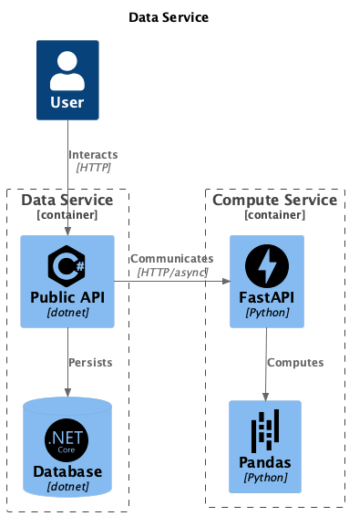

# System Integration synopsis

## Helicopter overview

The DataService provides an API that takes a CSV-file as input
As a prove of concept the [file](sample_data/bibliotek_sampledata.csv) contains a list of all the writers who received money from having their books at the library.
The file layout is:

| Name | Amunt Digital | Amount Physical | Amount Total |
| ---- | ------------- | --------------- | ------------ |
| Bobby | 10.0 | 11.0 | 22.0 |

The API sends the file to the Compute Service, which calculates some statistics and returns an object that is mapped to a database model and added to the database.

The system landscape is like this:

